# 相机标定

&emsp;&emsp;摄像机标定(Camera calibration)简单来说是从世界坐标系换到图像坐标系的过程，也就是求最终的投影矩阵的过程。在图像测量过程以及机器视觉应用中，为确定空间物体表面某点的三维几何位置与其在图像中对应点之间的相互关系，必须建立相机成像的几何模型，这些几何模型参数就是相机参数。求解几何模型参数的过程就称之为相机标定。  
&emsp;&emsp;无论是在图像测量或者机器视觉应用中，相机参数的标定都是非常关键的环节，其标定结果的精度及算法的稳定性直接影响相机工作产生结果的准确性。因此，做好相机标定是做好后续工作的前提，提高标定精度是科研工作的重点所在。  

# 1. 原理 

## 1.1 相机标定目的和意义

&emsp;&emsp;摄像机标定(Camera calibration)简单来说是从世界坐标系换到图像坐标系的过程，也就是求最终的投影矩阵的过程。在图像测量过程以及机器视觉应用中，为确定空间物体表面某点的三维几何位置与其在图像中对应点之间的相互关系，必须建立相机成像的几何模型，这些几何模型参数就是相机参数。求解几何模型参数的过程就称之为相机标定。  

&emsp;&emsp;在生活中我们一般是从三维世界得到二维照片，比如下图：


&emsp;&emsp;相机标定的目标是我们找一个合适的数学模型，求出这个模型的参数，这样我们能够近似这个三维到二维的过程，使这个三维到二维的过程的函数找到反函数。&emsp;


&emsp;&emsp;标定之后的相机，可以进行三维场景的重建，即深度的感知，这是计算机视觉的一大分支。无论是在图像测量或者机器视觉应用中，相机参数的标定都是非常关键的环节，其标定结果的精度及算法的稳定性直接影响相机工作产生结果的准确性。因此，做好相机标定是做好后续工作的前提，提高标定精度是科研工作的重点所在。    

## 1.2 基本方法
在视觉测量中，需要进行的一个重要预备工作是定义四个坐标系的意义，即 **摄像机坐标系** 、 **图像物理坐标系、 像素坐标系** 和 **世界坐标系（参考坐标系）** 。


**投影矩阵P**就是三维真实点到归一化平面上的点
**内参矩阵K**就是把点从物理相机映射到归一化成像平面上
**外参矩阵[R|T]**就是相机与真实世界左边变换

**基本步骤如下：**

1. 先求出该坐标系下投影矩阵
2. 将投影矩阵分为内参与外参矩阵

## 1.3 线性标定方法
&emsp;&emsp;最简单的相机标定为线性标定，即不考虑相机的畸变而只考虑空间坐标转换。每个坐标点有X,Y两个变量，可列两个方程，相机内参有5个未知数，外参平移和旋转各3个，共有11个变量，因此至少需要6个特征点来求解。由于假定相机没有偏差，其投影矩阵就是非奇异(可逆的)也就是良性的。  
<center></center>
对这个方程用齐次线性最小二乘法求解，计算m值使得最小,只要n》=6就能保证p的秩为11，且投影矩阵有唯一解。
## 1.4 非线性方法
&emsp;&emsp;这种方法可以不用假设偏差为0，把所有约束都考虑进去。当镜头畸变明显时必须考虑畸变，一般较为便宜的网络摄像头畸变特别大，而价格较贵的工业摄像头则畸变很小，因为其中已经嵌入了许多消除畸变的程序。这时线性模型转化为非线性模型，需要通过非线性标定方法求解。有最速下降法，遗传算法，高斯牛顿法和神经网络算法等。
## 1.5 张正友标定算法
&emsp;&emsp;”张正友标定”是指张正友教授1998年提出的单平面棋盘格的摄像机标定方法「1」。文中提出的方法介于传统标定法和自标定法之间，但克服了传统标定法需要的高精度标定物的缺点，而仅需使用一个打印出来的棋盘格就可以。同时也相对于自标定而言，提高了精度，便于操作。因此张氏标定法被广泛应用于计算机视觉方面。  
### 原理
&emsp;&emsp;设三维世界点坐标为, 二维相机平面像素坐标为，所以标定用的棋盘格平面到图像平面的单应性关系为：其中，s是世界坐标系到图像坐标系的尺度因子，A是相机内参矩阵，R是旋转矩阵，t是平移矩阵。  
将棋盘格定位于Z=0,则有：  
<center></center>
<center>  </center>
令于是空间到图像的映射可改为： sm=HM ， 其中H是描述Homographic矩阵，H是一个齐次矩阵，所以有8个未知数，至少需要8个方程，每对对应点能提供两个方程，所以至少需要四个对应点，就可以算出世界平面到图像平面的单应性矩阵H。

#### 计算外参
外部参数可以由Homography求解，由,可推出：  


#### 计算内参
由r1和r2正交，且r1和r2的模相等，可以得到如下约束：  
<center></center>
<center>  </center>
定义  其中B中的未知量可以表示为6D向量b：
可以推出：  
<center>  </center>
如果有n张影像，带入上式并联立起来，就能得到：  
<center>  </center>
根据推到的结果可知如果有n组观察图像，则V 是 2n x 6 的矩阵
根据最小二乘定义， 的解是 的最小特征值对应的特征向量。
因此, 可以直接估算出 B。之后根据 ，对下列式子计算相机内参：  


# 2. 张正友标定方法实验与结果评估
在实验中我使用的是如下的棋盘图片：  
<center class="half">
    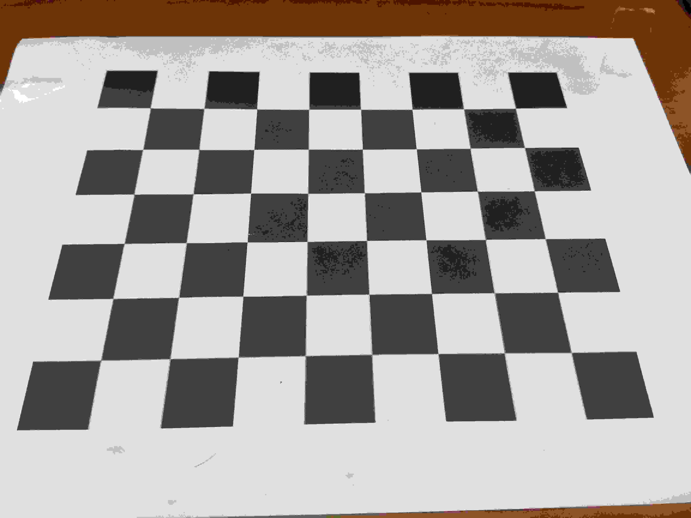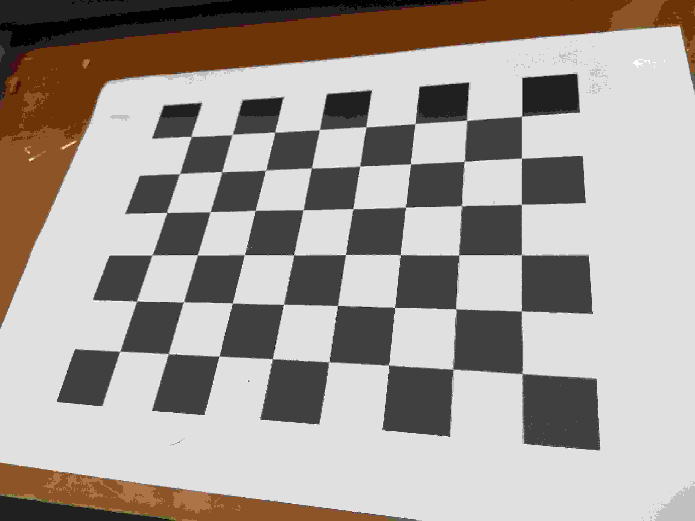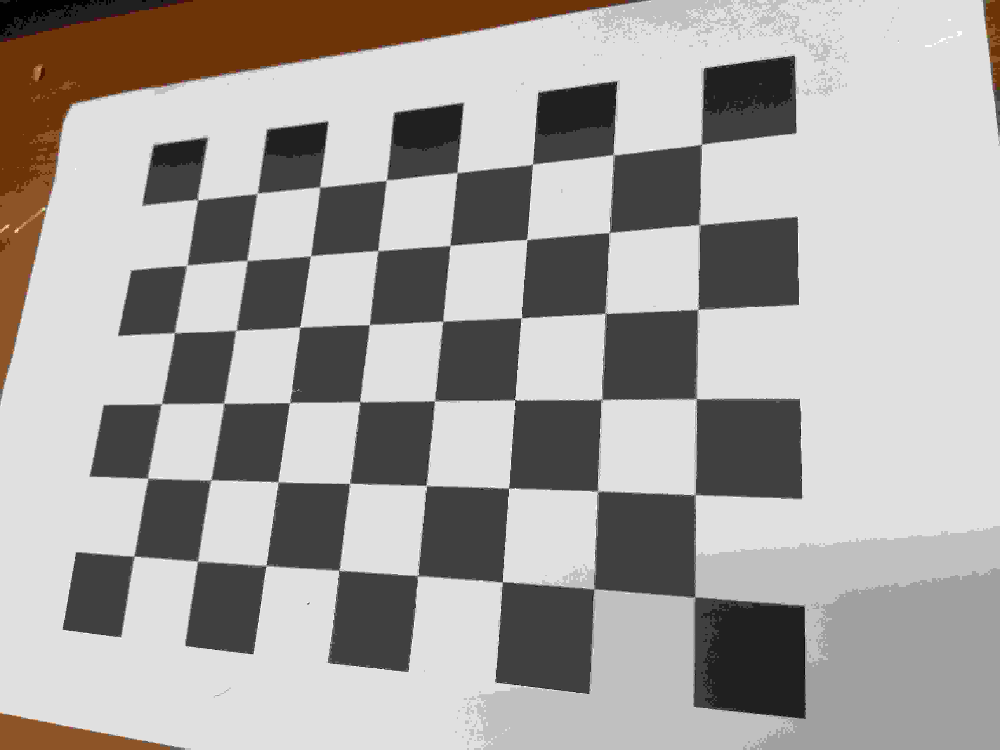
</center>

<center class="half">
	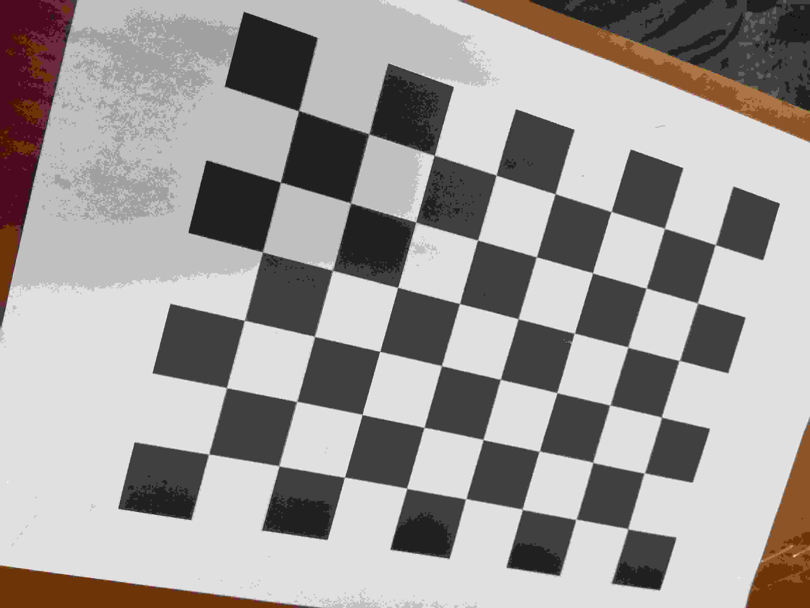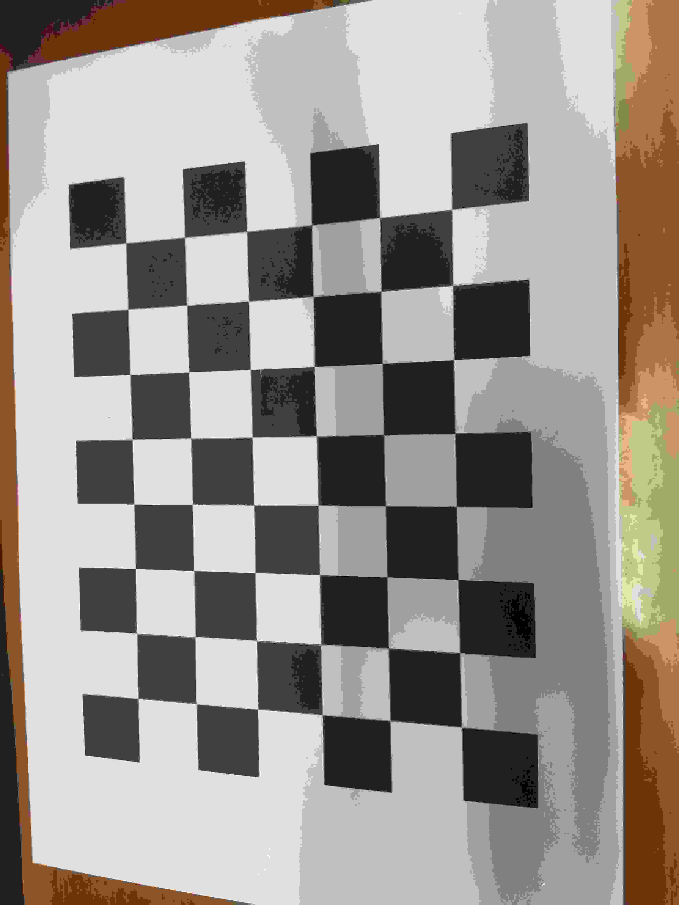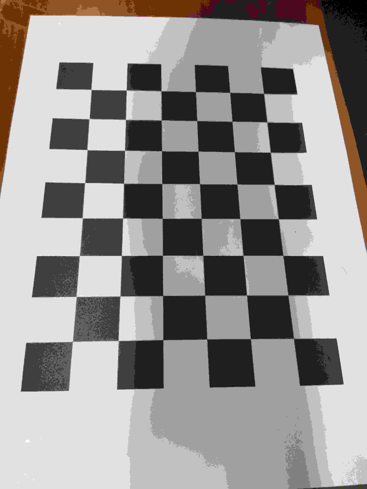
</center>

<center class="half">
    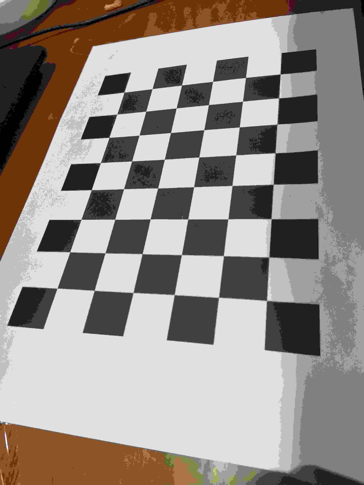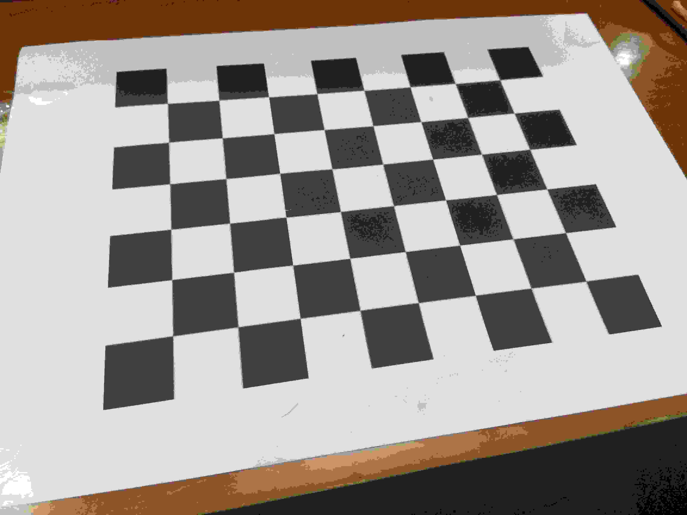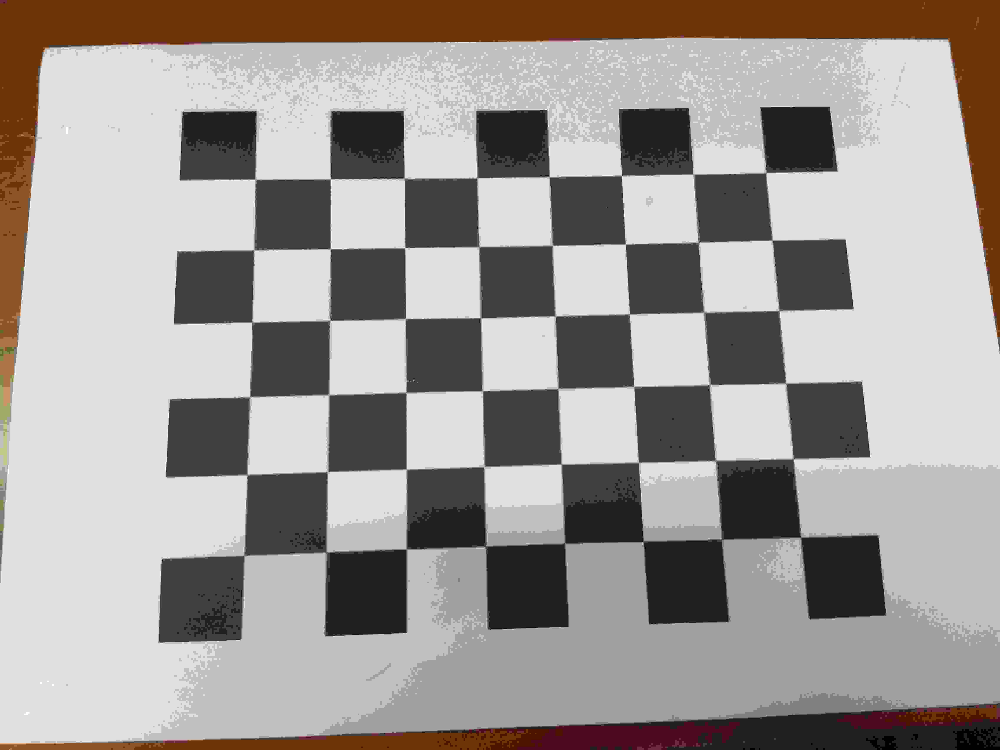
</center>
&emsp;&emsp;如果讲xoy平面放在棋盘格上(Z=0)，那么很容易可以得到目标的世界坐标系，如图1-1所示。在本实验中使用的坐标由7×9的棋盘格子，但是在后来的角点检测中只是用内部的格子，最外一圈格子是不会是用的，那么使用以下步骤可以很容易得到用来标定的角点：  
1. 对图像使用Harris角点检测器
2. 对这些角点使用霍夫变换来找到直线
3. 讲上面找到的线按照从左到右从上到下顺序排列
4. 对这些线条求向量差乘就是最终要的角点

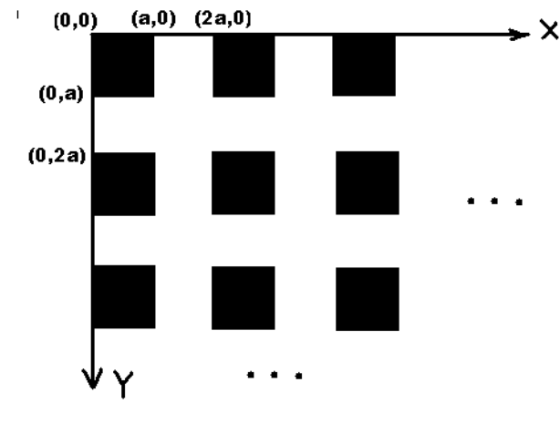
<center>图1-1 世界坐标下的棋盘(在本实验中a=23)</center>

### 2.1 角点检测
在本实验中使用如下代码进行计算Harris角点:

```
def compute_harris_response(im,sigma=3):
    imx=np.zeros(im.shape)
    filters.gaussian_filter(im,(sigma,sigma),(0,1),imx)
    imy=np.zeros(im.shape)
    filters.gaussian_filter(im,(sigma,sigma),(1,0),imy)
    Wxx=filters.gaussian_filter(imx*imx,sigma)
    Wxy=filters.gaussian_filter(imx*imy,sigma)
    Wyy=filters.gaussian_filter(imy*imy,sigma)
    Wdet=Wxx*Wyy-Wxy**2
    Wtr=Wxx+Wyy
    return Wdet/Wtr

def get_harris_points(harrisim,min_dist=10,threshold=0.1):
    corner_threshold=harrisim.max()*threshold
    harrisim_t=(harrisim>corner_threshold)*1
    coords=np.array(harrisim_t.nonzero()).T
    candidate_values=[harrisim[c[0],c[1]] for c in coords]
    index=np.argsort(candidate_values)
    allowed_locations=np.zeros(harrisim.shape)
    allowed_locations[min_dist:-min_dist,min_dist:-min_dist]=1
    filtered_coords=[]
    for i in index:
        if allowed_locations[coords[i,0],coords[i,1]]==1:
            filtered_coords.append(coords[i])
            allowed_locations[(coords[i,0]-min_dist):(coords[i,0]+min_dist),(coords[i,1]-min_dist):(coords[i,1]+min_dist)]
    return filtered_coords

```
角点检测结果如图2-2所示，其中有很多外点被检测到，但是这其实没什么影响。
<center class="half">
    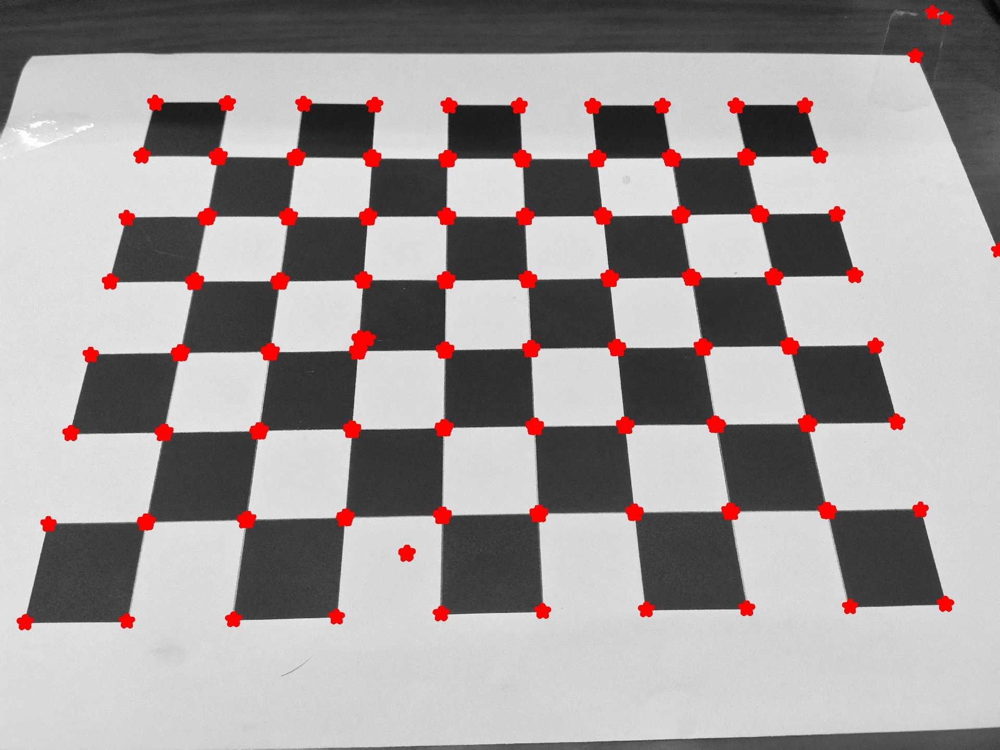 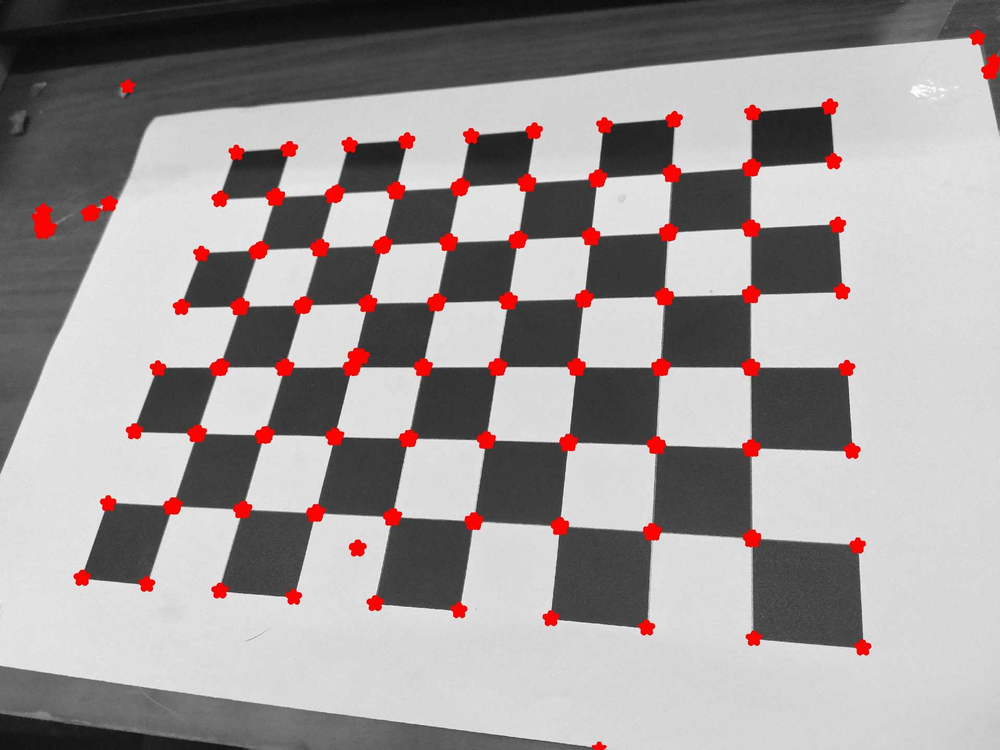
    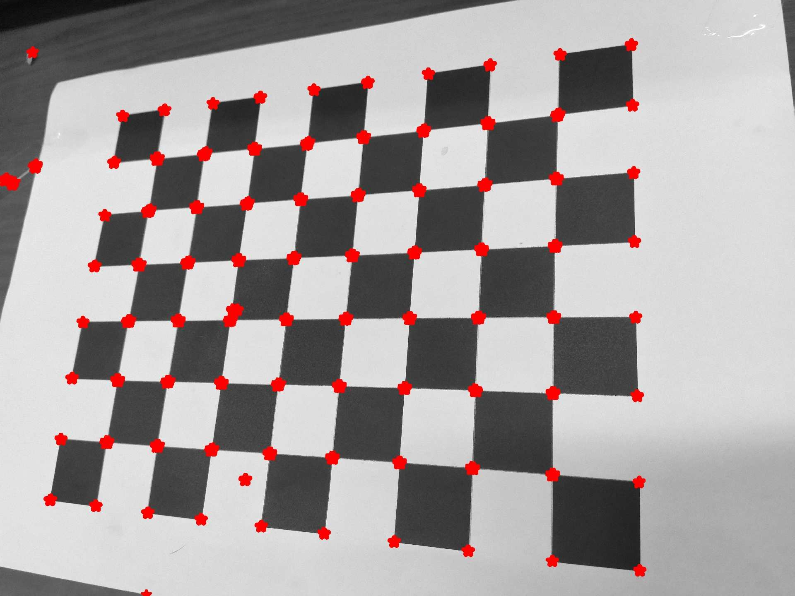 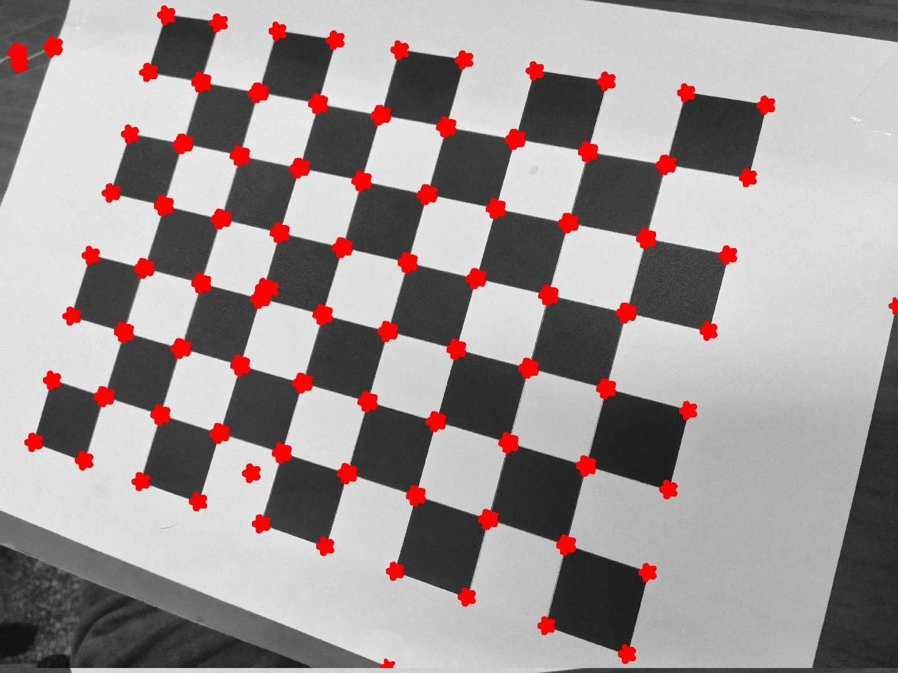
</center>
### 2.2 霍夫变换拟合直线棋盘
通过霍夫变换找到直线,代码如下:  
```
import Detector.HarrisCorner as harris
# 构建图片(二值图)
im = np.array(Image.open('1.jpg').convert('L'))
harrisim = harris.compute_harris_response(im)
filtered_coords = harris.get_harris_points(harrisim, 6)
x,y=im.shape
image = np.zeros((x, y))
for i in filtered_coords:
    image[i[0],i[1]]=255
h, theta, d = st.hough_line(image)
# 画出直线
for _, angle, dist in zip(*st.hough_line_peaks(h, theta, d)):
    y0 = (dist - 0 * np.cos(angle)) / np.sin(angle)
    y1 = (dist - col1 * np.cos(angle)) / np.sin(angle)
    ax2.plot((0, col1), (y0, y1), '-r')
```
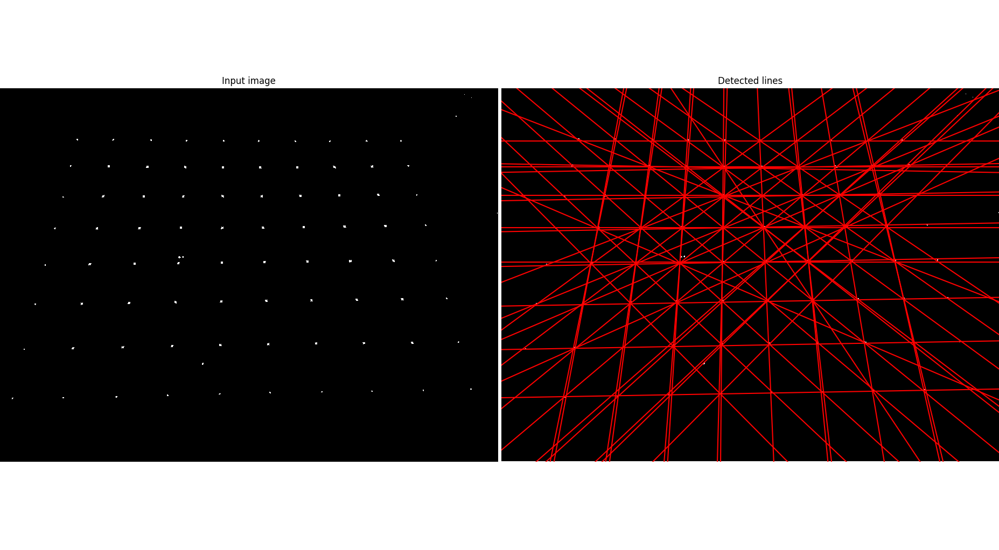
然后我们将具有相似斜率的线整合成为一条线,并且将同X和Y轴坐标角度差得过大的直线筛掉得到真正的直线，经过下面代码处理后得到的是最终的棋盘格。

```
// Grouping Lines for those similar rho & theta
void GroupLines(CvSeq* lines, int width, int height, CvSeq* lineSet1, CvSeq* lineSet2,
int* num1, int* num2){
	int i,j;
	int numlines = lines->total, numnewlines;
	float sumrho, sumtheta;
	float *linei, *linej;
	int count;
	CvMat *mask = cvCreateMat(1,numlines,CV_32FC1);
 	CvMat *newrho = cvCreateMat(1,numlines, CV_32FC1);
 	CvMat *newtheta = cvCreateMat(1,numlines, CV_32FC1);
	double theta1, theta2;
	double theta, rho;
 	CvPoint2D32f pt;
 	CvPoint pt1, pt2;
    cvZero(mask);
 	numnewlines = 0;
	for(i = 0; i < numlines; i++){
 		if(cvmGet(mask,0,i) == 1)
 			continue;
     linei = (float*)cvGetSeqElem(lines,i);
     sumrho = linei[0];
     sumtheta = linei[1];
     cvmSet(mask,0,i,1.0);
     count = 1;
     for(j = i+1; j < numlines; j++){
     	linej = (float*)cvGetSeqElem(lines,j);
 		if(pow(linei[0]-linej[0], (float)2.0) < 100 && pow(linei[1]-	linej[1],(float)2.0) < 1e-2){
 			sumrho += linej[0];
             sumtheta += linej[1];
             count++;
             cvmSet(mask,0,j,1.0);
 			} 
 		}
	 cvmSet(newrho,0,numnewlines,(double)sumrho/count);
 	cvmSet(newtheta,0,numnewlines,(double)sumtheta/count);
	 numnewlines++;
 }
 printf("%d %d\n", numlines, numnewlines);
 theta1 = cvmGet(newtheta, 0, 0);
 i = 1;
while(pow(abs(theta1)-abs(cvmGet(newtheta, 0, i)), 2.0) < 5*1e-1){
	 i++;
 }
 theta2 = cvmGet(newtheta, 0, i);
// Set lineSet1, lineSet2
 *num1 = 0;
 *num2 = 0;
for(i = 0; i<numnewlines; i++){
     if(pow(theta1-cvmGet(newtheta, 0, i), 2.0) < 5*1e-1 || pow(theta1-
    (CV_PI+cvmGet(newtheta, 0, i)), 2.0) < 5*1e-1){
     	pt = cvPoint2D32f(cvmGet(newrho,0,i), cvmGet(newtheta,0,i));
     	cvSeqPush(lineSet1, &pt);
 (*num1)++;
 	}
 }
 lineSet1->total = *num1;

for(i = 0; i<numnewlines; i++){
     if(pow(theta2-cvmGet(newtheta, 0, i), 2.0) < 5*1e-1 || pow(theta2-
    (CV_PI+cvmGet(newtheta, 0, i)), 2.0) < 5*1e-1){
         pt = cvPoint2D32f(cvmGet(newrho,0,i), cvmGet(newtheta,0,i));
         cvSeqPush(lineSet2, &pt);
         (*num2)++;
	 }
 }
 lineSet2->total = *num2;
// sort lines by value of rho
 SortLines(lineSet1, *num1);
 SortLines(lineSet2, *num2);
 cvReleaseMat(&mask);
 cvReleaseMat(&newrho);
 cvReleaseMat(&newtheta);
} 

```
### 2.3 得到棋盘角点
两直线叉乘就是角点，实现很简单，得到最终结果如下:
<center class="half">
    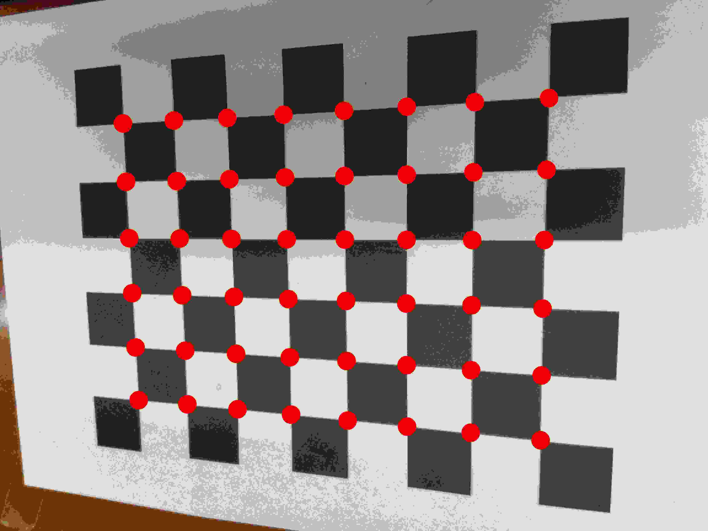 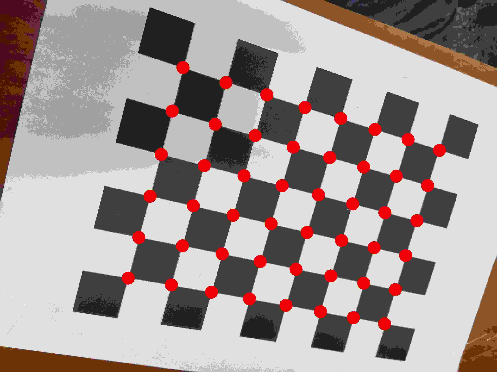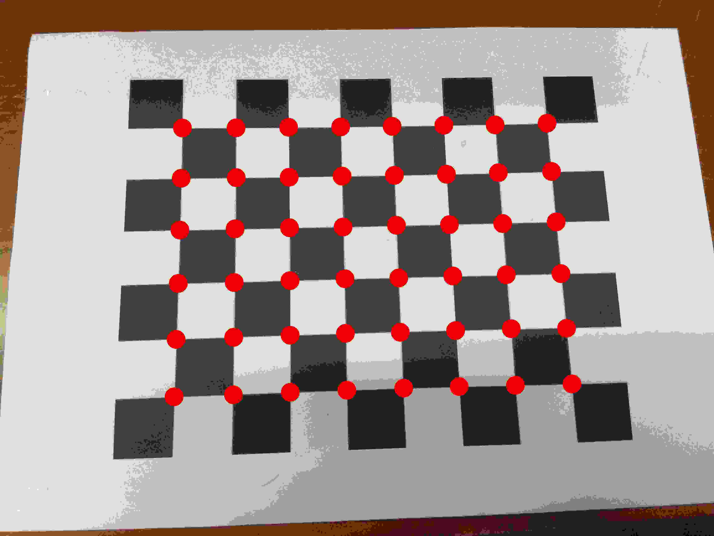 
    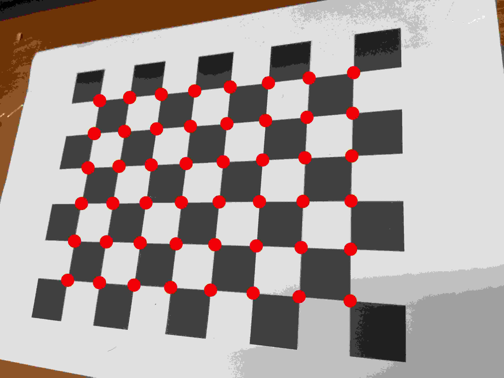 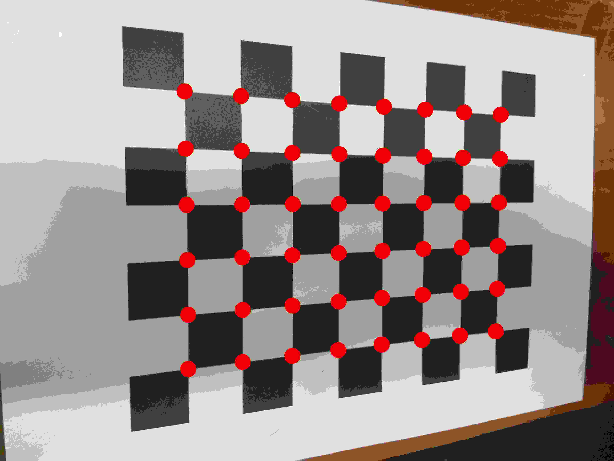 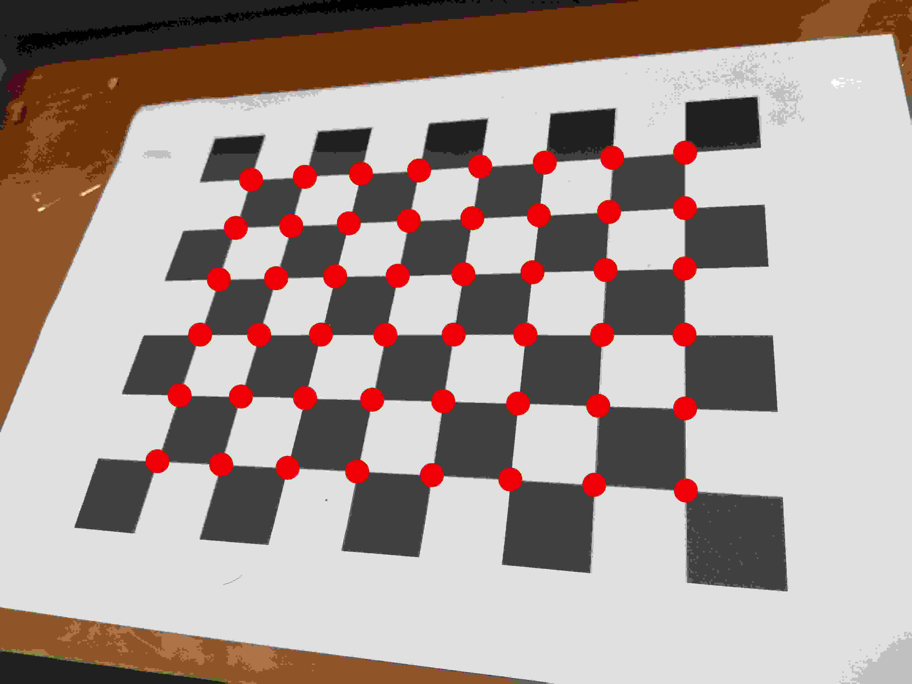 
    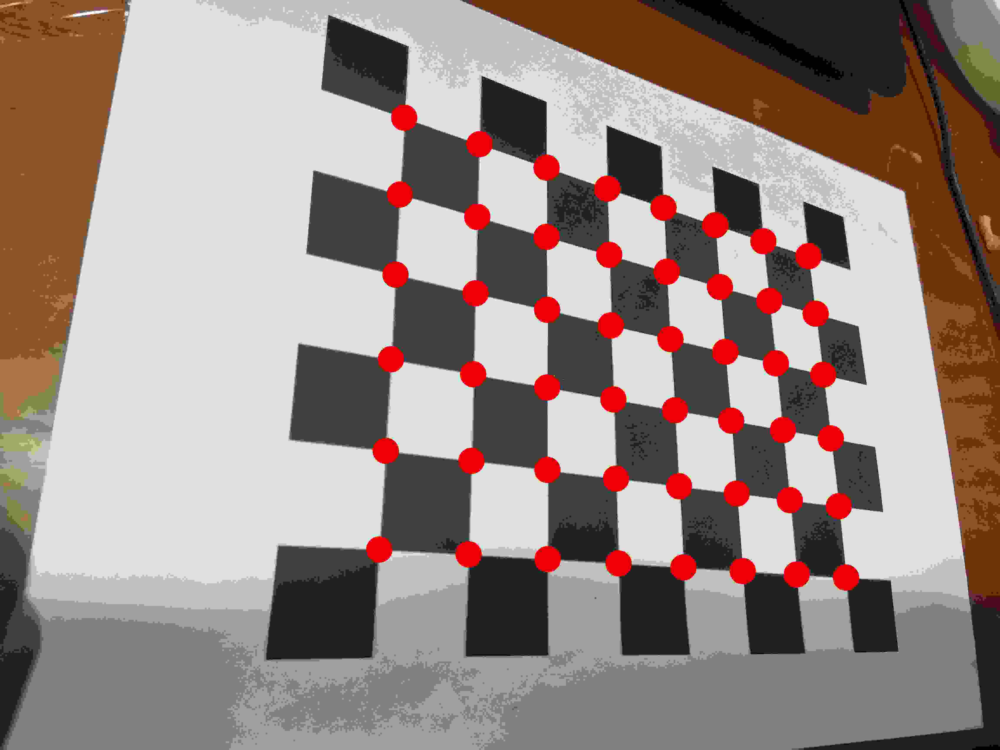  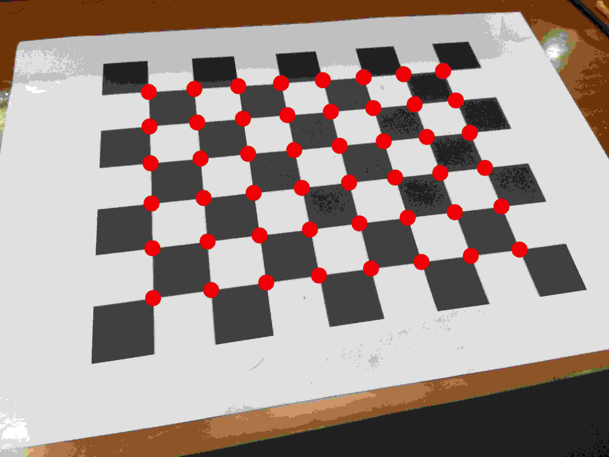 
</center>
### 2.4 计算单应矩阵
##### 归一化点
&emsp;&emsp;接下来需要计算每张图的单应矩阵,但是在此之前需要先把图片归一化,这样做可以得到更好的结果.下面的代码对点对进行归一化操作,归一化就是将点减去均值,这样子可以确保后面求单应矩阵方程有解.
```
    # normalize
    m=np.mean(fp[:2],axis=1)
    maxstd=np.max(np.std(fp[:2],axis=1))+1e-9
    C1=np.diag([1/maxstd,1/maxstd,1])
    C1[0][2]=-m[0]/maxstd
    C1[1][2]=-m[1]/maxstd
    fp=np.dot(C1,fp)

    m=np.mean(tp[:2],axis=1)
    maxstd=np.max(np.std(tp[:2],axis=1))+1e-9
    C2=np.diag([1/maxstd,1/maxstd,1])
    C2[0][2]=-m[0]/maxstd
    C2[1][2]=-m[1]/maxstd
    tp=np.dot(C2,tp)
```
##### 构造求解方程组
经过归一化后,我们需要将点的方程式列出来,如下面那样就是我们的A矩阵,有N个点就有2*N行.
<center></center>
使用的代码如下:
```
    nbr_correspondences = fp.shape[1]
    # a是构造出来的Ax=0里面的A矩阵，之后往里面填充数据。
    A = np.zeros((2 * nbr_correspondences, 9))
    for i in range(nbr_correspondences):
        A[2 * i] = [-fp[0][i], -fp[1][i], -1, 0, 0, 0, tp[0][i] * fp[0][i], tp[0][i] * fp[1][i], tp[0][i]]
        A[2 * i + 1] = [0, 0, 0, -fp[0][i], -fp[1][i], -1, tp[1][i] * fp[0][i],tp[1][i] * fp[1][i], tp[1][i]]
```
##### 求解单应矩阵
&emsp;&emsp;我们要求解的是AX=0的方程组,一般有两种方法可以求解:首先就是x=0,但是这样的解显然不是我们需要的.其次就是使用最小二乘法近似逼近解.使用最小二乘法首要要求就是 min" />,对于这样的系统可以使用SVD分解法来求解.
<center>
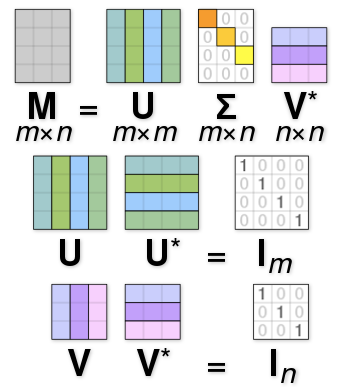 
</center>
解x是S方程中第九列,也就是最小值.
计算代码如下:
```
    U,S,V = np.linalg.svd(A)
    H=V[8].reshape((3,3))
```
最后反归一化就可以得到最终的单应矩阵
```
    H = np.dot(np.linalg.inv(C2),np.dot(H,C1))
    H = H/H[2,2]
```
### 2.5 计算内参矩阵
由前面推倒的公式我们可以知道
<center></center>
又因为每个视角下的单应矩阵都由内参变换和外参投影组成,所以:
<center></center>
如果用竖矩阵形式，则方程也是：
<center></center>
由于前面所说的这个公式又可以展开为：
<center></center>
因为R0和R1是正交的，所以它们相乘为0，我们可以得到：
<center></center>
令那么：
<center></center>
下面我们就建立v矩阵：
<center></center>
所以我们点乘B可以得到如下约束：
<center></center>
使用SVD分解就可以得到B的近似解，代码如下:
```
def get_intrinsic_parameters(H_r):
        M = len(H_r)
        V = np.zeros((2*M, 6), np.float64)

        def v_pq(p, q, H):
            v = np.array([
                    H[0, p]*H[0, q],
                    H[0, p]*H[1, q] + H[1, p]*H[0, q],
                    H[1, p]*H[1, q],
                    H[2, p]*H[0, q] + H[0, p]*H[2, q],
                    H[2, p]*H[1, q] + H[1, p]*H[2, q],
                    H[2, p]*H[2, q]
                ])
            return v

        for i in range(M):
            H = H_r[i]
            V[2*i] = v_pq(p=0, q=1, H=H)
            V[2*i + 1] = np.subtract(v_pq(p=0, q=0, H=H), v_pq(p=1, q=1, H=H))

        # solve V.b = 0
        u, s, vh = np.linalg.svd(V)
        b = vh[np.argmin(s)]
        print("V.b = 0 Solution : ", b.shape)
```
一旦得到B矩阵，根据前面公式很容易得到内参的各个解。

### 2.6 结果及分析

实验结果如下:


OpenCV标定结果如下：


可以看出其实算出来的内参矩阵在大体上同OpenCV的是一样的，只是gamma的值差得有点大。误差主要存在两个方面：

1. 棋盘特征点提取精度不如OpenCV中实现的好
2. 在计算单应矩阵时候没有优化结果

## 3. 参考资料

1.  《相机标定究竟在标定什么？》https://zhuanlan.zhihu.com/p/30813733
2.  《Computing the intrinsic camera matrix using Zhangs algorithm》 https://kushalvyas.github.io/calib.html
3.  https://blog.csdn.net/a083614/article/details/78579163