# 1、光流
## 1.1 基本概念
&emsp;&emsp;光流场（optical flow）就是用于描述三维空间中的运动物体表现到二维图像中，所反映出的像素点的运动向量场。从本质上说，光流就是你在这个运动着的世界里感觉到的明显的视觉运动。例如，当你坐在火车上，然后往窗外看。你可以看到树、地面、建筑等等，他们都在往后退。这个运动就是光流。
#### 光流可以分为:
1. 当描述部分像素时，称为：稀疏光流
2. 当描述全部像素时，称为：稠密光流

&emsp;&emsp;光流法是利用图像序列中的像素在时间域上的变化、相邻帧之间的相关性来找到的上一帧跟当前帧间存在的对应关系，计算出相邻帧之间物体的运动信息的一种方法。  简单说也就是画面移动过程中，图像上每个像素的x，y位移量，比如第t帧的时候A点的位置是(x1, y1)，那么我们在第t+1帧的时候再找到A点，假如它的位置是(x2,y2)，那么我们就可以确定A点的运动了：(u, v) = (x2, y2) - (x1,y1)

### 基本假设 
**亮度相同**  
  
假设**小位移**，泰勒展开后得到：  
  
可以推断出来结论：  
  


## 1.2、LK光流 LUCAS & KANADE
&emsp;&emsp;在计算机视觉中，卢卡斯-金出方法是一种广泛使用的光流估计的差分方法，这个方法是由Bruce D. Lucas和Takeo Kanade发明的。它假设光流在像素点的邻域是一个常数，然后使用最小二乘法对邻域中的所有像素点求解基本的光流方程。 
&emsp;&emsp;通过结合几个邻近像素点的信息，卢卡斯-金出方法(简称为L-K方法)通常能够消除光流方程里的多义性。而且，与逐点计算的方法相比，L-K方法对图像噪声不敏感。不过，由于这是一种局部方法，所以在图像的均匀区域内部，L-K方法无法提供光流信息。   
**三个假设**：  
**1、 亮度恒定**  
就是同一点随着时间的变化，其亮度不会发生改变。  
**2、小运动**  
时间的变化不会引起位置的剧烈变化，这样灰度才能对位置求偏导  
**3、空间一致**  
一个场景上邻近的点投影到图像上也是邻近点，且邻近点速度一致。

由于相邻帧的位移很小，所以可以认为研究点p的临域内大致为常数，因此可以假设光流方程在p的窗口中所有像素都是成立的。 那么将窗口中的所有像素光流方程都列出来得到：
<center></center>  
<center></center>  
<center>……</center>  
<center></center>  
其中，q1,q2,…,qn是窗口中的像素， Ix(qi),Iy(qi),It(qi) 是图像在点 qi和当前时间对位置x，y和时间t的偏导。  
整理得 

<center>  </center>

<center>  </center>

此方程组的等式个数多于未知数个数，所以它通常是超定的。L-K方法使用最小二乘法获得一个近似解，即计算一个2x2的方程组：   
<center>  </center>
<center>  </center>
最终计算的是：  
<center>  </center>
对i=1到n求和。 矩阵 ATA通常被称作图像在点p的结构张量。

## 1.3、HS光流 Horn&Schunck
&emsp;&emsp;1981年，Horn和Schunck根据同一个运动物体的光流场具有连续、平滑的特点, 提出一个附加约束条件，将光流场的整体平滑约束转换为一个变分的问题。它的能量方程如下：  
<center>  </center>
其中数据项表示灰度值守恒约束，平滑项表示光流平滑约束。根据上面的理论分析，可以把光流法的计算划分为三个阶段

## 算法流程

#### 预处理阶段
这一阶段是平滑处理的图像序列，它的作用是用来减少图像噪音和外部的影响，通常用卷积来实现的。这一阶段是一个通用的图像操作。
#### 梯度计算阶段
首先计算Ix和Iy，也就是图像梯度，在文中使用的是如下模板：  
<center class="harf">
&emsp;&emsp;&emsp;  </center>

 <center>mask1&emsp;&emsp;mask2&emsp;&emsp;mask3&emsp;&emsp;mask4 
对两幅图片用mask1卷积可以得到x方向的导数  
对两幅图片用mask2卷积可以得到y方向的导数  
对第一幅图片用mask3卷积加上第二幅图片用mask4卷积可以得到t方向的导数  

#### 迭代阶段
循环直至收敛：  
  
  
  
 

在这里Xav是X周围四个像素的平均值 

我们应该找一个能最小化下面方程的v(u,v)
<center> </center>

LSE 优化方法需要我们优化下面两个误差方程的和：

<center></center>
<center></center>
<center></center>

算法流程:  
```
Use “odd” and “even” arrays for u- and v-values
1: for y = 1 to Nrows do
2:     for x = 1 to Ncols do
3:         Compute Ix (x, y), Iy (x, y), and It(x, y) ;
4:         Initialize u(x, y) and v(x, y) (in even arrays);
5:     end for
6: end for
```
```
Threshold T is the maximum number of iterations (e.g. T = 7)
1: Select weight factor λ; select T > 1; set n = 1;
2: while n ≤ T do
3:      for y = 1 to Nrows do
4:          for x = 1 to Ncols {in alternation for even or odd arrays}
            do
5:          Compute α(x, y, n);
6:          Compute u(x, y) = ¯u − α(x, y, n) · Ix (x, y,t) ;
7:          Compute v(x, y) = ¯v − α(x, y, n) · Iy (x, y,t) ;
8:          end for
9:      end for
10:     n := n + 1;
11: end while
```
# 2. 实验数据和评价
## 2.1 LK方法实现
代码如下：
```
def optical_flow(I1g, I2g, window_size, tau=1e-2):
    kernel_x = np.array([[-1., 1.], [-1., 1.]])
    kernel_y = np.array([[-1., -1.], [1., 1.]])
    kernel_t = np.array([[1., 1.], [1., 1.]])#*.25
    w = int(window_size/2) # window_size is odd, all the pixels with offset in between [-w, w] are inside the window
    I1g = I1g / 255. # normalize pixels
    I2g = I2g / 255. # normalize pixels
    # for each point, calculate I_x, I_y, I_t
    mode = 'same'
    fx = signal.convolve2d(I1g, kernel_x, boundary='symm', mode=mode)
    fy = signal.convolve2d(I1g, kernel_y, boundary='symm', mode=mode)
    ft = signal.convolve2d(I2g, kernel_t, boundary='symm', mode=mode)+signal.convolve2d(I1g, -kernel_t, boundary='symm', mode=mode)
    u = np.zeros(I1g.shape)
    v = np.zeros(I1g.shape)
    # within window window_size * window_size
    for i in range(w, I1g.shape[0]-w):
        for j in range(w, I1g.shape[1]-w):
            Ix = fx[i-w:i+w+1, j-w:j+w+1].flatten()
            Iy = fy[i-w:i+w+1, j-w:j+w+1].flatten()
            It = ft[i-w:i+w+1, j-w:j+w+1].flatten()
            b = np.reshape(It, (It.shape[0], 1))# get b here
            A = np.vstack((Ix, Iy)).T # get A here
            # if threshold τ is larger than the smallest eigenvalue of A'A:
            if np.min(abs(np.linalg.eigvals(np.matmul(A.T, A)))) >= tau:
                nu = np.matmul(np.linalg.pinv(A), b) # get velocity here
                u[i,j]=nu[0]
                v[i,j]=nu[1]
    return (u,v)

```
对得到的xy方向的速度值合成可以得到最终的光流场,本实验得到结果如下:  
其中箭头代表光流矢量的方向，横线长度代表光流的大小
<center class="half">
    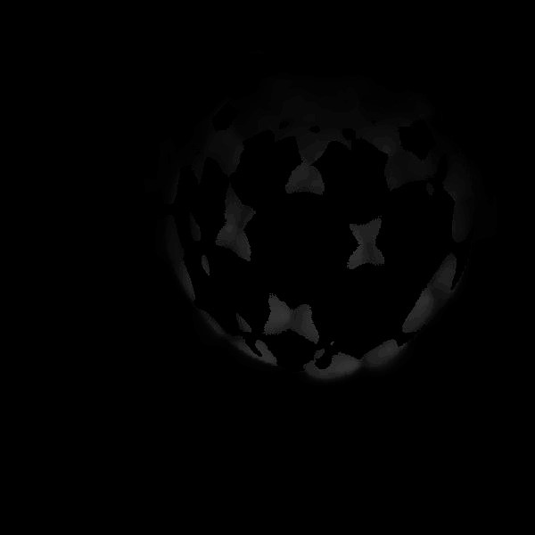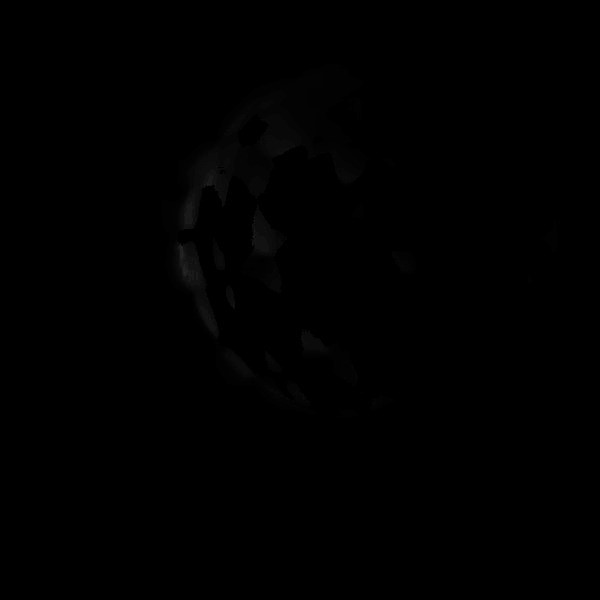
    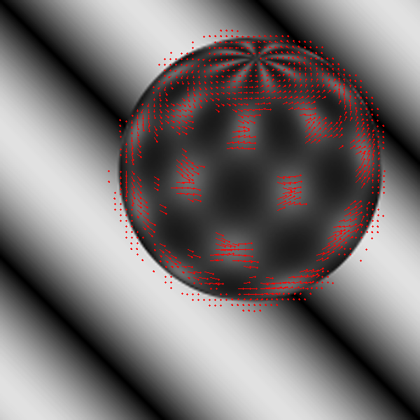
</center>

<center class="half">
    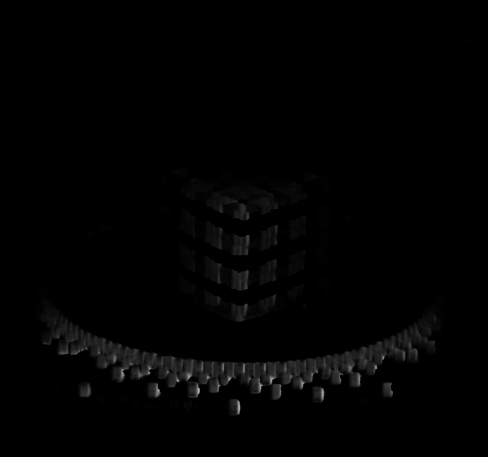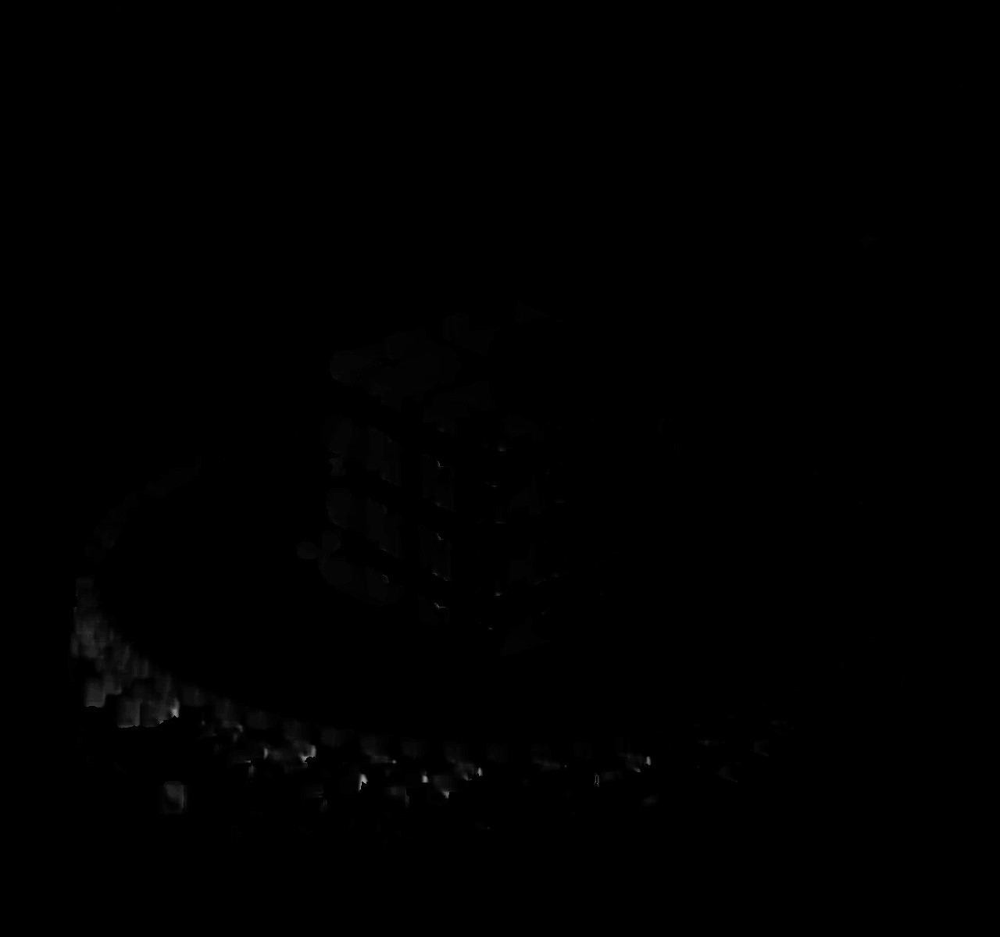
    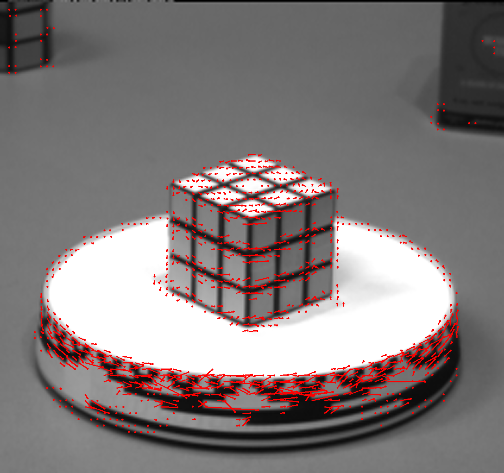
</center>


## 2.2 H-S方式实现

实验代码如下:
```

cv::Mat get_fx(cv::Mat& src1, cv::Mat& src2){
    cv::Mat fx;
    cv::Mat kernel = cv::Mat::ones(2,2,CV_64FC1);
    kernel.at<double>(0,0) = -1.0;
    kernel.at<double>(1,0) = -1.0;

    cv::Mat dst1,dst2;
    cv::filter2D(src1,dst1,-1,kernel);
    cv::filter2D(src2,dst2,-1,kernel);

    fx = dst1+dst2;
    return fx;
}

cv::Mat get_fy(cv::Mat &src1, cv::Mat &src2){
    cv::Mat fy;
    cv::Mat kernel = cv::Mat::ones(2, 2, CV_64FC1);
    kernel.at<double>(0, 0) = -1.0;
    kernel.at<double>(0, 1) = -1.0;

    cv::Mat dst1, dst2;
    filter2D(src1, dst1, -1, kernel);
    filter2D(src2, dst2, -1, kernel);

    fy = dst1 + dst2;
    return fy;
}

cv::Mat get_ft(cv::Mat &src1, cv::Mat &src2){
    cv::Mat ft;
    cv::Mat kernel = cv::Mat::ones(2, 2, CV_64FC1);
    kernel = kernel.mul(-1);

    cv::Mat dst1, dst2;
    filter2D(src1, dst1, -1, kernel);
    kernel = kernel.mul(-1);
    filter2D(src2, dst2, -1, kernel);

    ft = dst1 + dst2;
    return ft;
}

```
实验结果如下图所示  
其中箭头代表光流矢量的方向，横线长度代表光流的大小

<center class="half">
    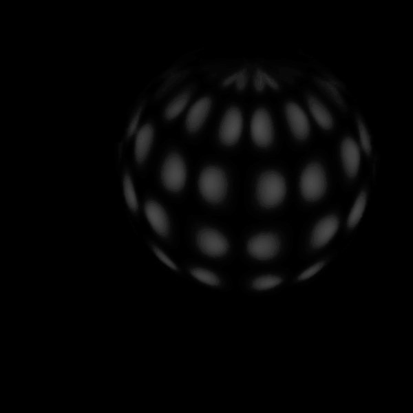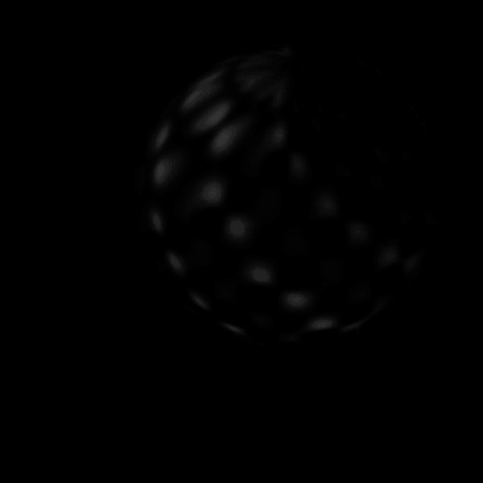
    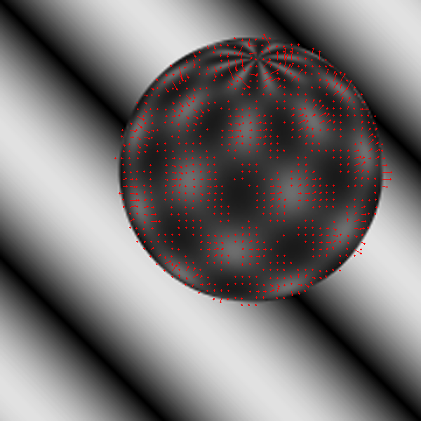
</center>

<center class="half">
    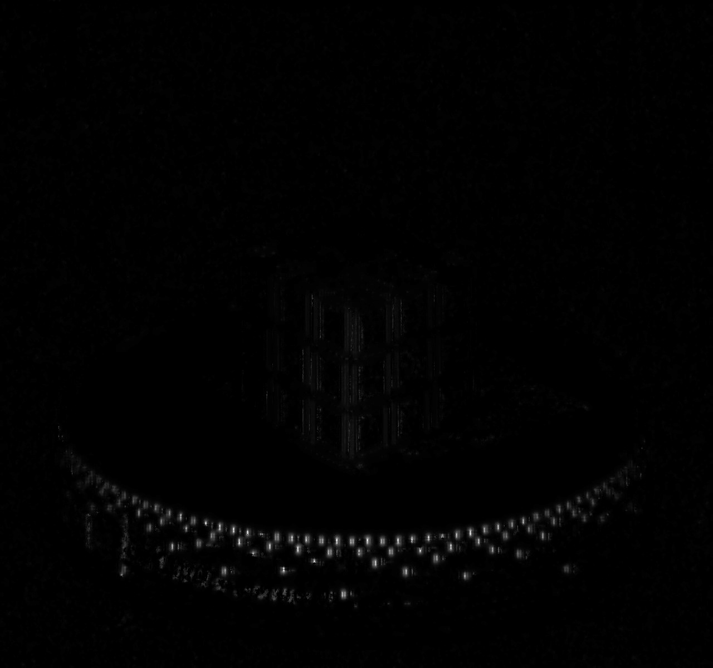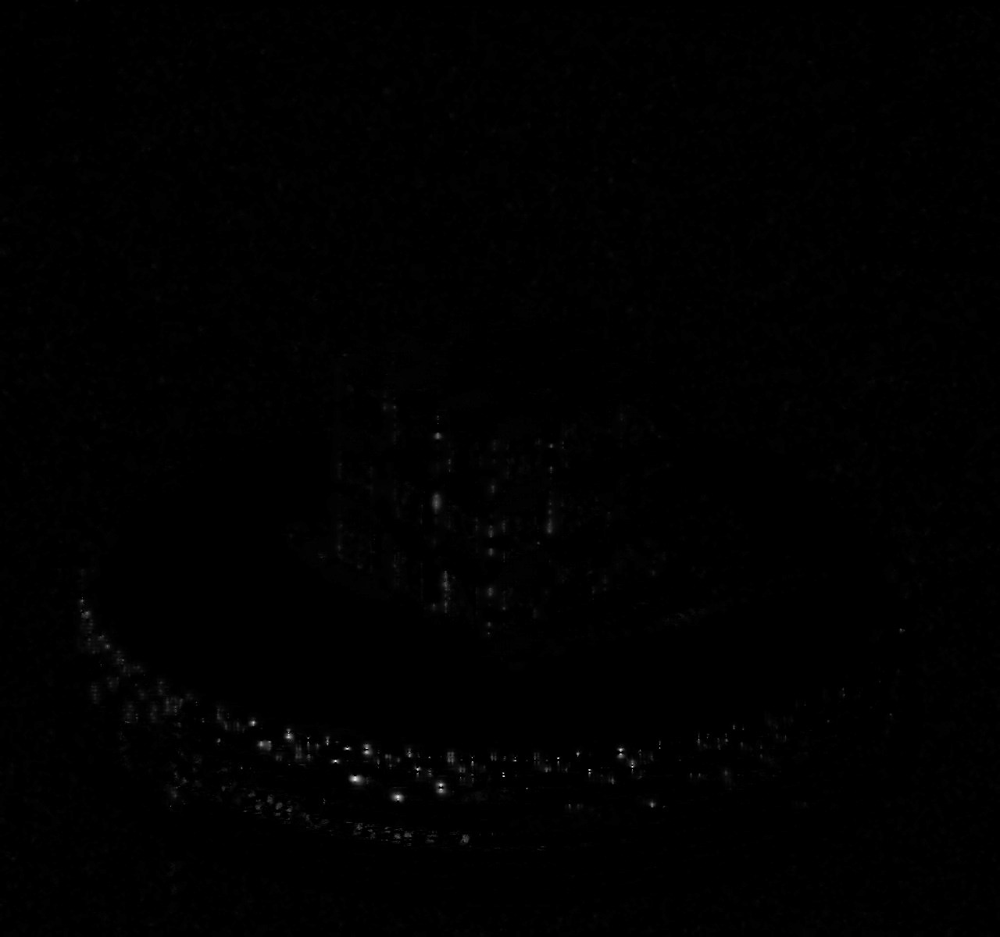
    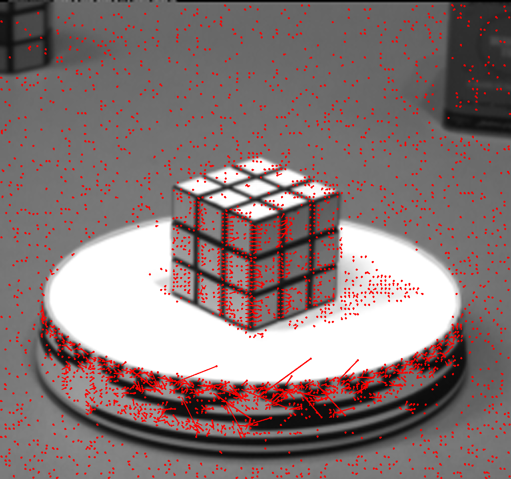
</center>


## 2.3 对比评估
### 性能比较
跟据实验测试，LK光流算法的计算时间为15 ms，HS光流算法的计算时间为62 ms 。 HS和LK光流都是积于梯度的光流算法,不同的是HS是稠密光流,而LK是基于特征点的稀疏光流。
### 鲁棒性比较
通过实现结果比较，我们发现LK光流比HS光流更加稳定。HS光流算法是全局光流算法，对噪声比较敏感，但却能得到稠密的光流场。LK和PryLK光流算法对噪声具有一定的鲁棒性，但只能得到稀疏的光流场。

### 技术应用
光流算法可以得到运动点的速度和方向，由于这个特点我们可以在下面场景中应用：

（1）通过光流算法得到全局光流场，对光流场进行聚类分析，检测运动物体。

（2）可以通过分析光流场，解决由于相机抖动，或则树叶的摆动等引起的波动式干扰，因为这些波动式干扰造成光流矢量呈现周期性变化的趋势。 

（3）通过光流预测进行运动目标的跟踪。 

（4）光流法可以得到亚像素级的运动矢量，可以用光流技术进行步态分析。

（5）由于光流法是计算物体间的相对运动，所以可以用光流技术来实现动态背景下的目标检测与跟踪。